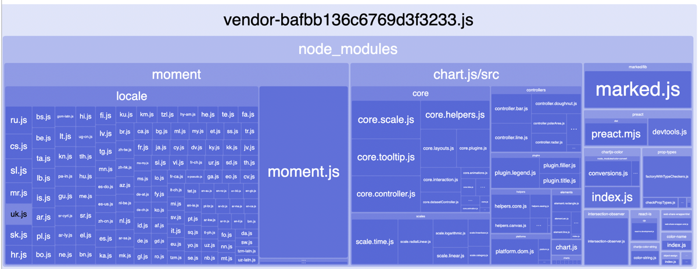
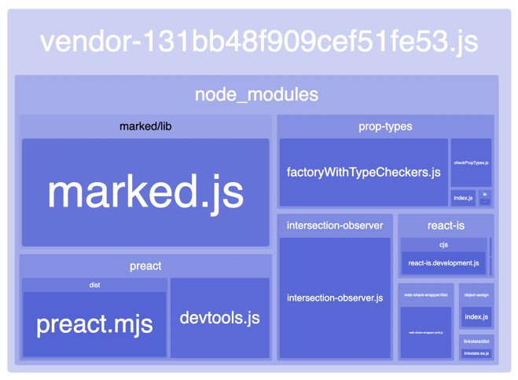

# Case-study оптимизации

## Актуальная проблема
В проекте dev.to нашли проблему - избыточный объём `js` в проекте

## Формирование метрики
Для того, чтобы понимать, дают ли мои изменения положительный эффект я задала бюджет:
- объём загружаемого `js` на главной странице должен быть не больше 449.2 KB

## Вникаем в детали системы, чтобы найти главные точки роста
Для того, чтобы найти "точки роста" для оптимизации я воспользовалась отчетом sitespeed.io

### Ваша находка №1
До оптимизаций на главной странице:
```JavaScript Transfer Size with value 1.0 MB limit max 449.2 KB```

Vendor до оптимизаций:


devtool coverage показывает, что ~60% js не используется

в vendor большую часть занимает moment (чуть меньше половины всего vendor)

в ./yarn.lock видно, что chart.js зависит от moment, а также от chartjs-color, скорее всего проблема лишнего js как раз тут

уберем moment из vendor (module.context.indexOf('moment') === -1):
```JavaScript Transfer Size with value 753.3 KB limit max 449.2 KB```

уберем chartjs-color, который также есть в зависимотях chart.js (module.context.indexOf('chartjs-color') === -1):
```JavaScript Transfer Size with value 727.5 KB limit max 449.2 KB```

уберем chart.js, так как он не используется на главной странице (module.context.indexOf('chart') === -1):
```JavaScript Transfer Size with value 452.2 KB limit max 449.2 KB```

у chartjs-color тоже есть зависимости, одна из них chartjs-color-string, уберем их (!/chartjs-color/.test(module.context)):
```JavaScript Transfer Size with value 452.1 KB limit max 449.2 KB``` АААААА

уберем color-name (зависимость chartjs-color-string):
```JavaScript Transfer Size with value 448.0 KB limit max 449.2 KB``` (ура)

еще у chartjs-color есть зависимость color-convert, уберем ее (!/color-convert/.test(module.context)):
```JavaScript Transfer Size with value 448.0 KB limit max 449.2 KB```

Отрефакторим условие (!/chart|moment|color-name|color-convert/.test(module.context)):
```JavaScript Transfer Size with value 448.0 KB limit max 449.2 KB```

Vendor после оптимизаций:


## Результаты
в результате оптимизации удалось уменьшить объем загружаемого js на главной странице с 1.0 MB до 448.0 KB и уложиться в бюджет 449.2 KB

## Защита от регрессии производительности
Для защиты от потери достигнутого прогресса при дальнейших изменениях программы был настроен CI
